# ⚠️ สิ่งที่ต้องมีก่อนที่จะเริ่ม
### 1. MetaMask Wallet [[ลิ้งคลิก]](https://chromewebstore.google.com/detail/metamask/nkbihfbeogaeaoehlefnkodbefgpgknn)
### 2. เชื่อมกระเป๋าเพื่อลงทะเบียน & ดูคะแนน [[ลิ้งคลิก]](https://www.glacier.io/points/)


### 3. เพิ่ม BNB Smart Chain [[ลิ้งคลิก]](https://chainlist.org/chain/56)
### 4. ต้องมี `0.002 BNB` บน BNB Smart Chain

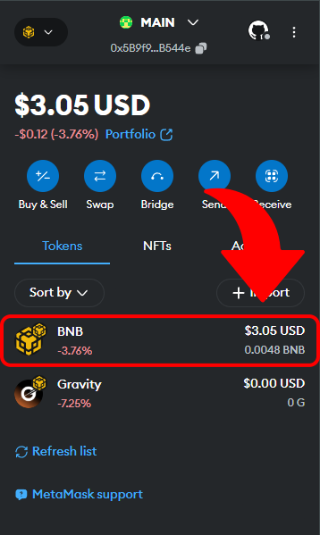

‎ 
# 💻 สเปคที่ต้องการสำหรับรันโหนด

### ขั่นต่ำ:
  - CPU with 1+ cores
  - 2GB RAM
  - 4 Mbps download Internet service
### แนะนำ:
  - Fast CPU with 2+ cores
  - 4GB+ RAM
  - 8+ Mbps download Internet service

‎ 
# 💸 วิธีในการขอ Faucet
### 1. เพิ่ม Network ของ opBNB Testnet ลงในกระเป๋า [[ลิ้งคลิก]](https://chainlist.org/chain/5611)

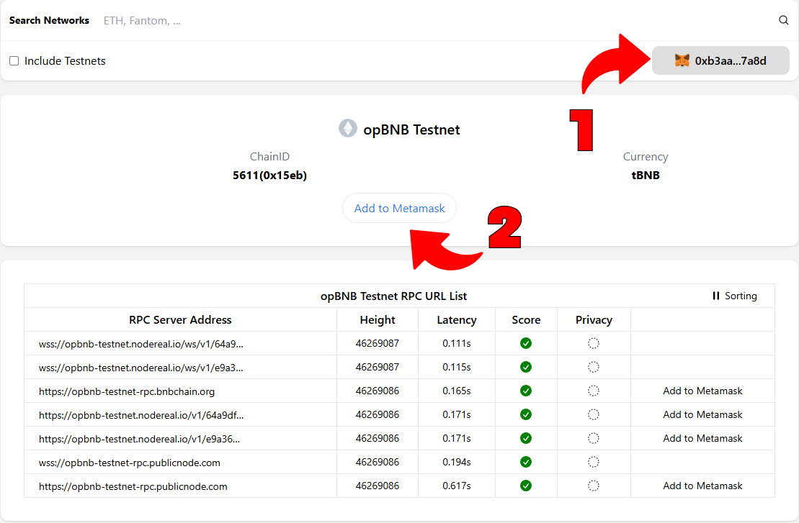

‎ 
### 2. ทำการขอ BNB Faucet [[ลิ้งคลิก]](https://www.bnbchain.org/en/testnet-faucet)

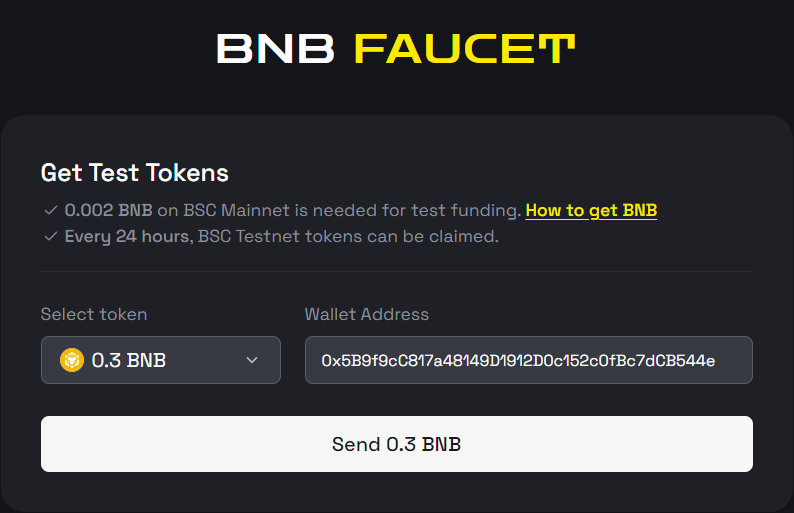

‎ 
### 3. ทำการแลก `0.1 BNB` จาก BNB Smart Chain Testnet ไปยัง opBNB Testnet [[ลิ้งคลิก]](https://opbnb-testnet-bridge.bnbchain.org/deposit)

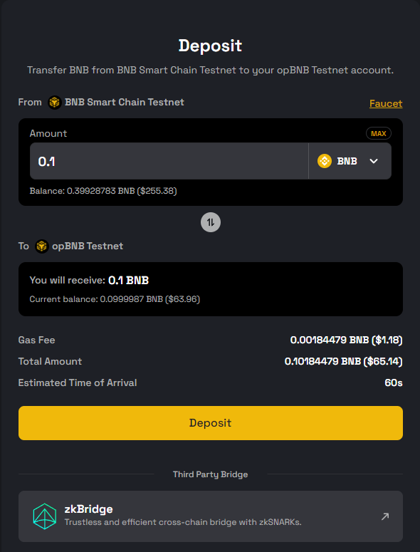
‎
# 🌐 วิธีติดตั้งบน Windows
### 1. สร้างโฟลเดอร์ใหม่ชื่อว่า Glacier ไปที่ Desktop > คลิกขวา > New > Folder > พิมพ์ว่า Glacier > Enter

<div style="text-align: center;">
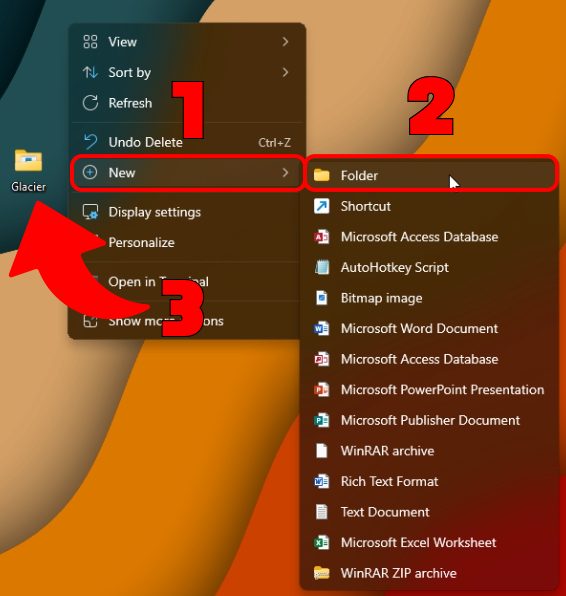
</div>

‎ 
### 2. ดาวน์โหลด Node จาก [Glacier Labs](https://github.com/Glacier-Labs/node-bootstrap/releases) (ไฟล์.exe) ลงในโฟลเดอร์ Glacier

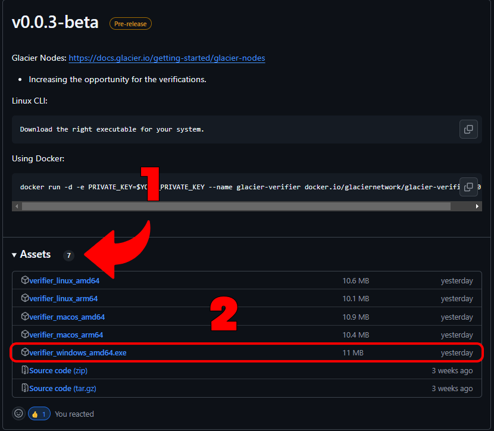

‎ 
### 3. เปิด Notepad ก็อปปี้คำสั่งจากด้านล่าง แล้ววางลงใน Notepad

```yaml
Http:
  Listen: "127.0.0.1:10801"
Network: "testnet"
RemoteBootstrap: "https://glacier-labs.github.io/node-bootstrap/"
Keystore:
  PrivateKey: "YourPrivateKey"
TEE:
  IpfsURL: "https://greenfield.onebitdev.com/ipfs/"
```

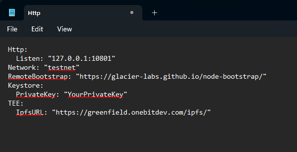

‎ 
### 4. วาง PrivateKey ของกระเป๋าเรา แทนคำว่า YourPrivateKey ใน Notepad
<div style="text-align: center;">
    <p>⬇️วิธีดู Private Key⬇️</p>
</div>

<div align="center">
    
    
</div>

‎ 
### 5. กดคำว่า File ซ้ายบน > Save as > Desktop > Glacier > ตั้งชื่อไฟล์ว่า config.yaml

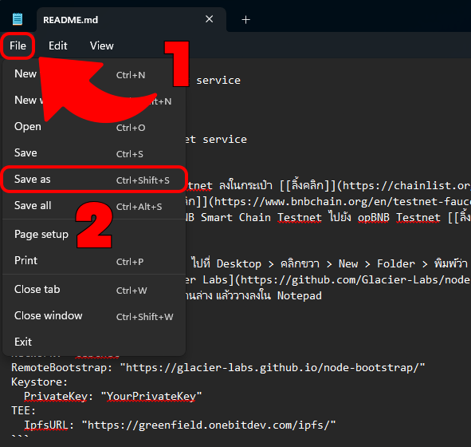

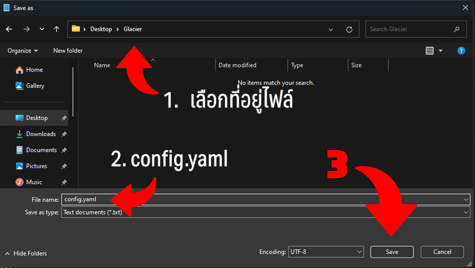

‎ 
### 6. เริ่มการทำงานของ Node ได้เลย

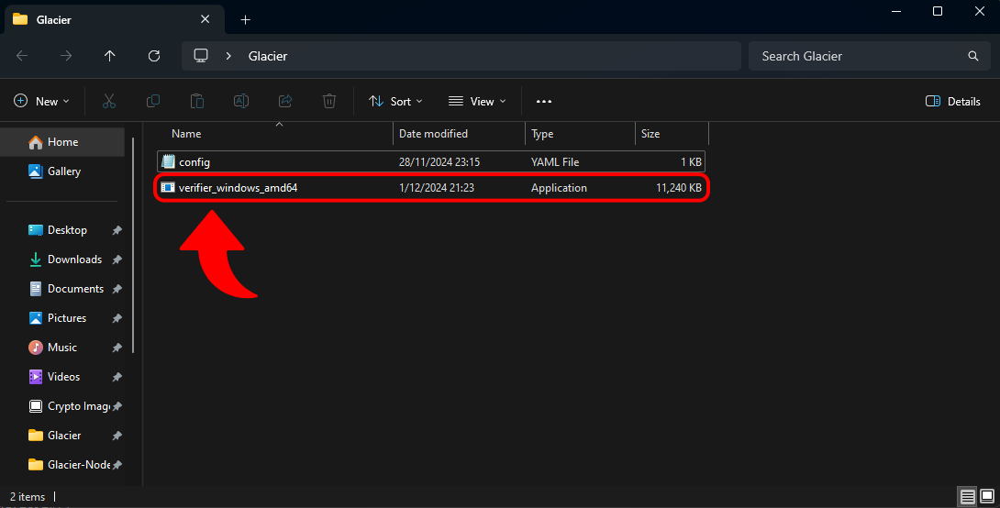

# ✅เช็คการทำงานของ Node
### เข้าเว็บนี้ ---> https://testnet.nodes.glacier.io/status

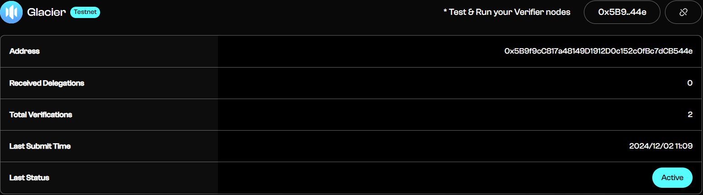

# 🎞️ ฝากติดตาม [Viwsion Mining](https://www.youtube.com/@VwisionMining/videos) ด้วยนะครับ

