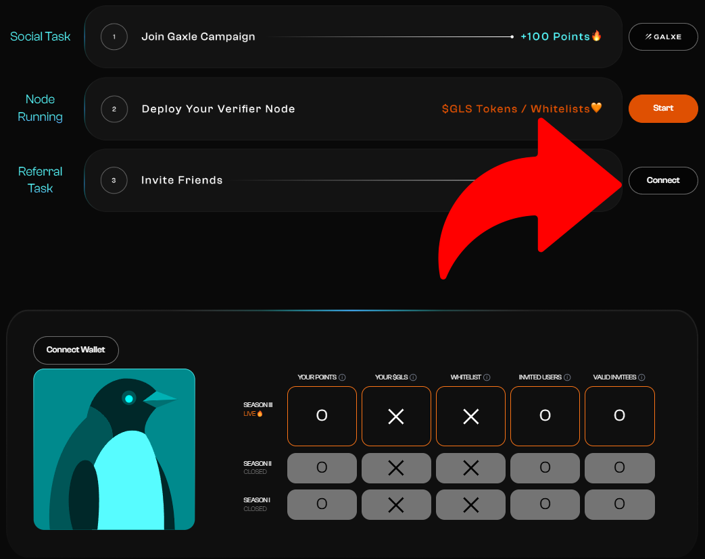
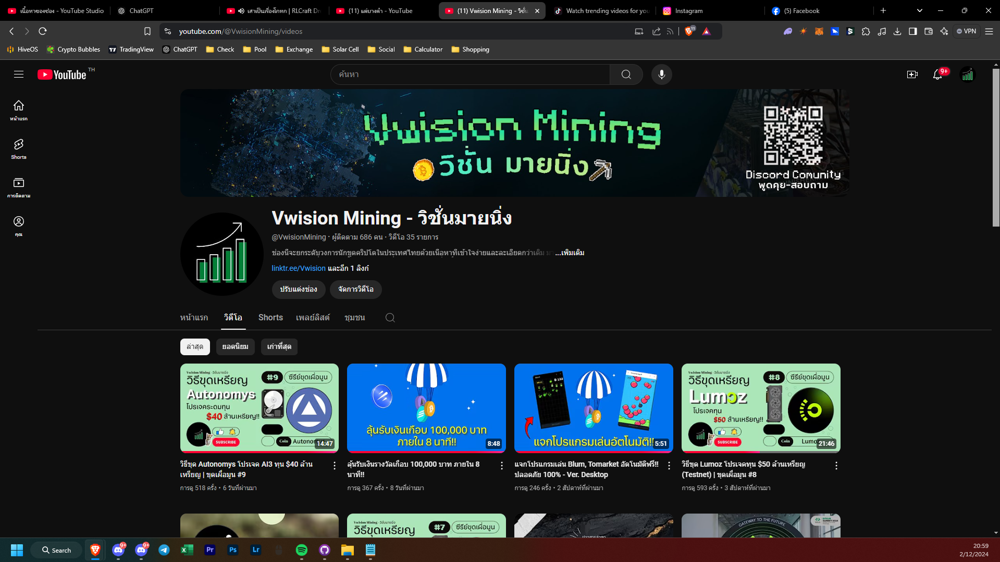

<h1 align="center">⚠️ สิ่งที่ต้องมีก่อนที่จะเริ่ม</h1>
<h3>1. MetaMask Wallet <a href="https://chromewebstore.google.com/detail/metamask/nkbihfbeogaeaoehlefnkodbefgpgknn" target="_blank">[ลิ้งคลิก]</a></h3>
<h3>2. เชื่อมกระเป๋าเพื่อลงทะเบียน & ดูคะแนน <a href="https://www.glacier.io/points/" target="_blank">[ลิ้งคลิก]</a></h3>


<h3>3. เพิ่ม BNB Smart Chain <a href="https://chainlist.org/chain/56" target="_blank">[ลิ้งคลิก]</a></h3>
<h3>4. ต้องมี <code>0.002 BNB</code> บน BNB Smart Chain</h3>


<h1 align="center">💻 สเปคที่ต้องการสำหรับรันโหนด</h1>
<h3>ขั้นต่ำ:</h3>
<ul>
  <li>CPU with 1+ cores</li>
  <li>2GB RAM</li>
  <li>4 Mbps download Internet service</li>
</ul>
<h3>แนะนำ:</h3>
<ul>
  <li>Fast CPU with 2+ cores</li>
  <li>4GB+ RAM</li>
  <li>8+ Mbps download Internet service</li>
</ul>

<h1 align="center">💸 วิธีในการขอ Faucet</h1>
<h3 align="center">1. เพิ่ม Network ของ opBNB Testnet ลงในกระเป๋า <a href="https://chainlist.org/chain/5611" target="_blank">[ลิ้งคลิก]</a></h3>


<h3 align="center">2. ทำการขอ BNB Faucet <a href="https://www.bnbchain.org/en/testnet-faucet" target="_blank">[ลิ้งคลิก]</a></h3>


<h3 align="center">3. ทำการแลก <code>0.1 BNB</code> จาก BNB Smart Chain Testnet ไปยัง opBNB Testnet <a href="https://opbnb-testnet-bridge.bnbchain.org/deposit" target="_blank">[ลิ้งคลิก]</a></h3>
<div align="center">
    
</div>

<h1 align="center">🌐 วิธีติดตั้งบน Windows</h1>
<h3 align="center">1. สร้างโฟลเดอร์ใหม่ชื่อว่า Glacier</h3>
<h3 align="center">ไปที่ Desktop > คลิกขวา > New > Folder > พิมพ์ว่า Glacier > Enter</h3>
<div align="center">
    
</div>

<h3 align="center">2. ดาวน์โหลด Node จาก <a href="https://github.com/Glacier-Labs/node-bootstrap/releases" target="_blank">Glacier Labs</a> (ไฟล์.exe) ลงในโฟลเดอร์ Glacier</h3>


<h3 align="center">3. เปิด Notepad ก็อปปี้คำสั่งจากด้านล่าง แล้ววางลงใน Notepad</h3>

```yaml
Http:
  Listen: "127.0.0.1:10801"
Network: "testnet"
RemoteBootstrap: "https://glacier-labs.github.io/node-bootstrap/"
Keystore:
  PrivateKey: "YourPrivateKey"
TEE:
  IpfsURL: "https://greenfield.onebitdev.com/ipfs/"
```
<div align="center">

</div>

<h3 align="center">4. วาง PrivateKey ของกระเป๋าเรา แทนคำว่า YourPrivateKey ใน Notepad</h3>
<div align="center">
    <h3>⬇️วิธีดู Private Key⬇️</h3>
    
    
</div>

<h3 align="center">5. File > Save as > Desktop > Glacier > ตั้งชื่อไฟล์ว่า config.yaml</h3>
<div align="center">


</div>

<h3 align="center">6. เช็คว่าทั้งสองไฟล์อยู่ใน Folder เดียวกัน & เริ่มการทำงานของ Node ได้เลย</h3>


<h1 align="center">✅เช็คการทำงานของ Node</h1>
<h3 align="center"> <a href="https://testnet.nodes.glacier.io/status" target="_blank">https://testnet.nodes.glacier.io/status</a></h3>


<h1 align="center">🎞️ ฝากติดตาม <a href="https://www.youtube.com/@VwisionMining/videos" target="_blank">Viwsion Mining</a> ด้วยนะครับ</h1>

